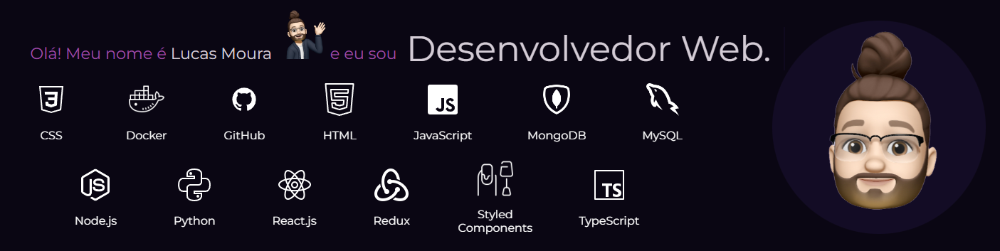

<h1 size="7"> Bem vindo ao meu GitHub! </h1>
  

  
  
  
   

  
  ## 
<h3  align="center"> 👨🏻‍💻 &nbsp;Sobre mim </h3>

- 🔺 &nbsp; Brasileiro, moro em Belo Horizonte, Minas Gerais.
- 👨‍💻 &nbsp; Desenvolvedor Web Fullstack.
- 💼 &nbsp; Formado em Administração de empresas.
- 🎸 &nbsp; Músico amador.
- 🐈 &nbsp; Apaixonado por gatos.
  
  ## 

<h3> 🛠 Stack</h3>

  

    
  
  
	

  
  
    
  
  

  

  
    
  
  
  
  

##
<h3  align="center"> Stats </h3>

  
  

